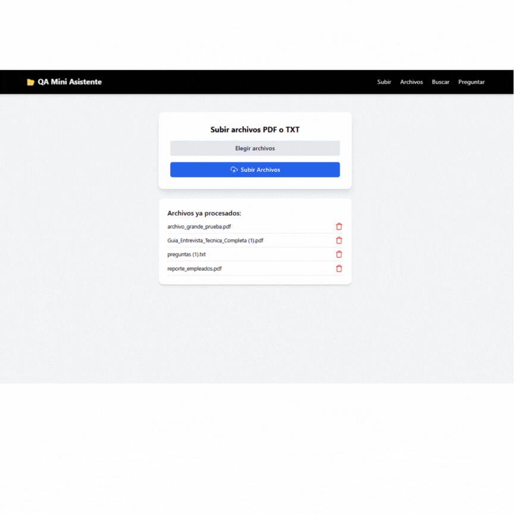

# 🧠 Mini Asistente de Q&A

Aplicación web que permite subir documentos PDF/TXT, realizar búsquedas dentro de ellos y hacer preguntas en lenguaje natural, obteniendo respuestas breves con citas de los documentos.

---

## 🚀 Tecnologías Utilizadas

- **Backend**: FastAPI (Python)
- **Frontend**: React + TypeScript
- **Motor de búsqueda**: TF-IDF con Scikit-learn
- **LLM (modelo de lenguaje)**: OpenAI GPT-3.5-Turbo
- **Contenedores**: Docker + Docker Compose
- **Otros**: SweetAlert2, Lucide React, Tailwind CSS

---

## ✅ Funcionalidades Implementadas

### 📂 Subida de archivos

- Se pueden subir entre 3 y 10 archivos `.pdf` o `.txt`.
- Se valida el tipo de archivo y el tamaño máximo permitido (5 MB).
- Los archivos subidos se almacenan y pueden visualizarse o eliminarse desde la interfaz.

### 🔍 Búsqueda de contenido (`/search`)

- Endpoint: `GET /search?q=...`
- Realiza búsqueda de los fragmentos más relevantes mediante TF-IDF.
- Devuelve:
  - Fragmento del texto
  - Nombre del documento
  - Puntaje de relevancia

### ❓ Preguntas en lenguaje natural (`/ask`)

- Endpoint: `POST /ask`
- Recibe una pregunta como JSON (`{ "question": "..." }`).
- Responde en 3–4 líneas utilizando un modelo de lenguaje (LLM).
- El contexto se construye con los fragmentos más relevantes mediante TF-IDF.
- Las respuestas incluyen citas clicables hacia los documentos fuente.
- Se utiliza **GPT-3.5-Turbo** de OpenAI para generar la respuesta final.

### 📦 Ingesta de documentos (`/ingest`)

- Endpoint: `POST /ingest`
- Procesa e indexa múltiples archivos recibidos en memoria.
- Divide en fragmentos para indexar con TF-IDF.

---

## 📸 Capturas de Pantalla



## ⚙️ Instrucciones de ejecución

1. Clona el repositorio:

```bash
git clone https://github.com/CspO6/qa-mini-asistente
cd qa-mini-asistente
```

2. Configura las variables de entorno:

Copia el archivo `.env.example` y renómbralo como `.env` dentro de la carpeta `backend/`. Luego reemplaza el valor de la variable con tu clave de OpenAI:
```bash
cp .env.example .env
```
OPENAI_API_KEY=sk-...  # Reemplaza con tu propia clave de OpenAI

⚠️ Nota importante:
Este archivo no está incluido en el repositorio por motivos de seguridad. Sin este archivo, no podrás realizar preguntas a los documentos utilizando la API de OpenAI.

3. Levanta los servicios:

docker-compose up --build


4. Accede a la app:

Frontend: http://localhost:3000
Backend: http://localhost:8000

🧠 Decisiones técnicas y supuestos

- Decidí utilizar **TF-IDF** para hacer la búsqueda de fragmentos relevantes porque es una solución sencilla, rápida y no requiere grandes recursos. Esto permite encontrar coincidencias en los documentos sin tener que usar bases de datos complejas ni técnicas de embeddings.
- Para responder preguntas, decidí usar GPT-3.5-Turbo de OpenAI como modelo de lenguaje. Lo elegí porque permite generar respuestas más naturales, claras y específicas, en lugar de limitarse a devolver fragmentos de texto. Primero, el sistema hace una búsqueda semántica con TF-IDF, identifica los fragmentos más relevantes, y luego se los pasa como contexto al modelo de OpenAI, que genera una respuesta usando solo esa información. Esta integración permite que el usuario obtenga una respuesta breve y útil, sin tener que leer todo el documento.
- Todos los archivos que se suben se almacenan localmente dentro de la carpeta `uploaded_files/`. No se usan servicios externos de almacenamiento por ahora para mantenerlo simple y local.
- No se utiliza un índice persistente. Toda la información se carga y procesa cada vez que se hace una pregunta, ya que el volumen de documentos en esta prueba técnica es bajo y no afecta el rendimiento.
- Se agregó validación tanto en el frontend como en el backend para limitar el tamaño y tipo de archivo permitido (solo `.pdf` y `.txt`, hasta 5MB), para evitar errores y mantener la app más segura y controlada.

⏱️ Tiempo invertido

12.5 horas en total:
- Backend (FastAPI): 3 horas
- Frontend (React + TypeScript): 3 horas
- Integración con OpenAI (implementación, ajustes de contexto y citaciones): 3.5 horas
- Validaciones, estilos y mejoras visuales: 1.5 horas
- Docker y documentación: 0.5 horas
- Pruebas finales y ajustes: 1 hora

🧪 Bonus Implementados

- Validaciones robustas de archivos (.txt, .pdf, 5MB)
- UI clara con estados de carga, error y éxito
- Citaciones clicables con enlaces al archivo
- Índice dividido por fragmentos
- Código limpio y modular
- Pruebas de backend

🐍 Backend (FastAPI + Pytest)
Se utiliza pytest para ejecutar las pruebas del backend.

📦 Instalar dependencias
Hay que asegurarse de tener un entorno virtual y las dependencias instaladas:

```bash
cd backend
python -m venv env
env\Scripts\activate
pip install -r requirements.txt
```

▶️ Ejecutar pruebas

```bash
pytest
```